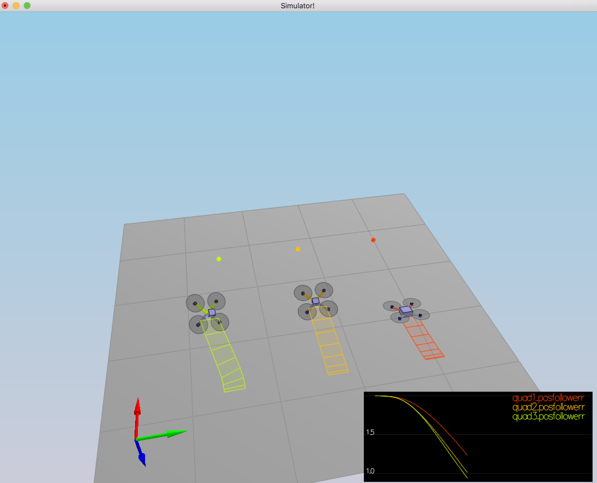
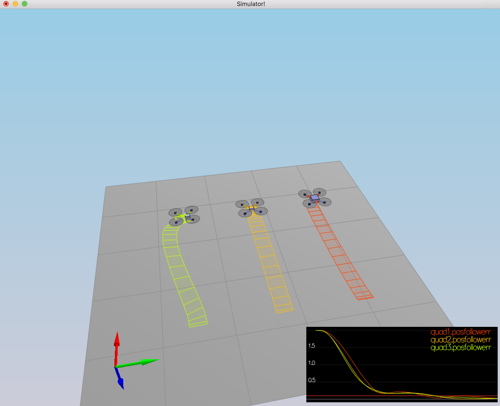
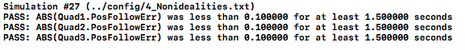

## Control of a 3D Quadrotor - Project (C++)

#### 1. Implemented body rate control in python and C++.

Proportional controller that gets desired and current body frame roll,pitch,yaw rate vector : prqCMD and prq respectivll. The controller defines an err = prqCMD-prq then multiplie by the moments of inertia coefitions : err*=MOI to convert it to moments and then scale by kpPQR control gain. 

#### 2. Implement roll pitch control in python and C++.

Most complicalicated PD controller that takes desired acceleration, current attitude and commanded thrust and return a desired pitch,roll rates in the body frame.

The desired rate is set as follows : b_targe = -(acceleration/drone_mass)

Then the error defined as : err = b_target - [R(0,2),R(1,2),0], where R describe the rotation matrix of the vehicle.

The error is scaled by kpBank : err*=kpBank, and rotate by the a sub rotation matrix to rotate from world frame to body frame, thats defined as : 

    world_to_frame = 
    |R(1,0)/R(2,2) ,-R(0,0)/R(2,2)|
    |R(1,1)/R(2,2) ,-R(0,1)/R(2,2)|

 #### 3. Implement altitude controller in C++.

The altitude controller is a PID controller, that takes commanded and current Z,Z velocity, feedforward Z acceleration with an attidute parmeter and a dt parameter.

The velocity parmeter is constrain by its max value.

The erros defined as follow : 
1. err_pos = Z_cmd - Z
2. err_vel = Z_vel_cmd - Z_vel
3. integral = err_pos*dt

The thrust is defined : thrust = err_pos * kpZ + err_vel * kpZvel + Z_feedforward + kpZi * integral.

Here the thrust is compensated by the rotation and converted to force: thrust = drone_mass * (9.81-thrust) / R(2,2), where R is the rotation matrix of the vehicle.

#### 4. Implement lateral position control in python and C++.

PD controller the takes : horizontal desired and current position and velocity with a feedforward acceleration.

Both horizontal velocity and return desired acceleration is constrained by min and max values.

The errors defined as : 
1. err_pos = pos_cmd - pos
2. err_vel = vel_cmd - vel

accel_cmd = err_pos*kpPosXY + err_vel*kpVelXY

#### 5. Implement yaw control in python and C++.

Simples P controller that returns desired yaw rate that defined by a proportion on an error between the commanded yaw and the current yaw.

desired_yaw = (yaw_cmd - yaw) * kpYaw. 

#### 5. Implement calculating the motor commands given commanded thrust and moments in C++.

Defining motors command with a given total_thrust and a desired moments.
The moments around the axis calculated as : 
1. x = moment_cmd.x / L
2. y = moment_cmd.y / L
3. z = moment_cmd.z / kappa
where 'L' is the length between the center of the vehicle and a motor and 'kappa' is a ratio 'torque/thrust' of the motor.

Now to find the relevant motors command the following equation need to be solved : 

     |1 ,1,1, 1| |f0|  |total_thrust|
     |1,-1,1,-1|*|f1| =|     x      |
     |1,1,-1,-1| |f2|  |     y      |
     |-1,1,1,-1| |f3|  |     z      |
     
Here f0,f1,f2,f3 is the commands that should be set to the motors.

## Results :

Senario 4 sesseion :

Console log :

