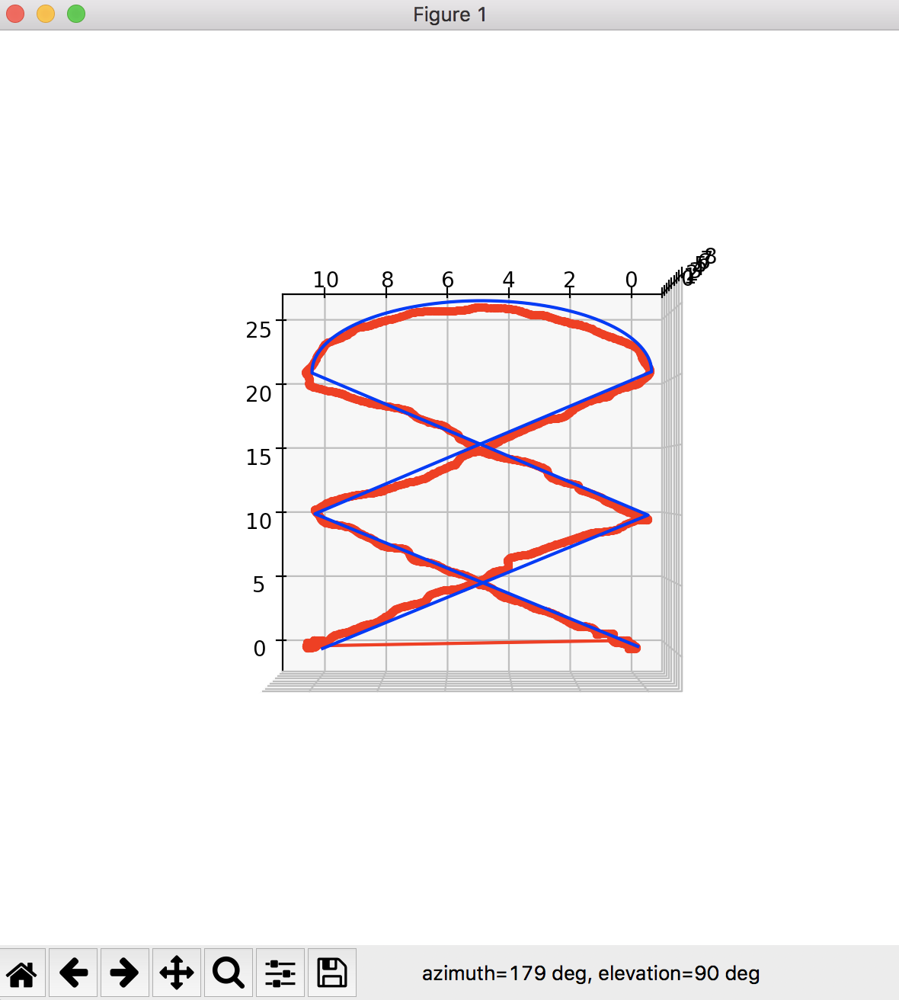
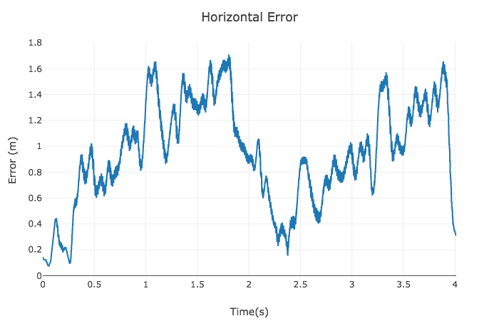
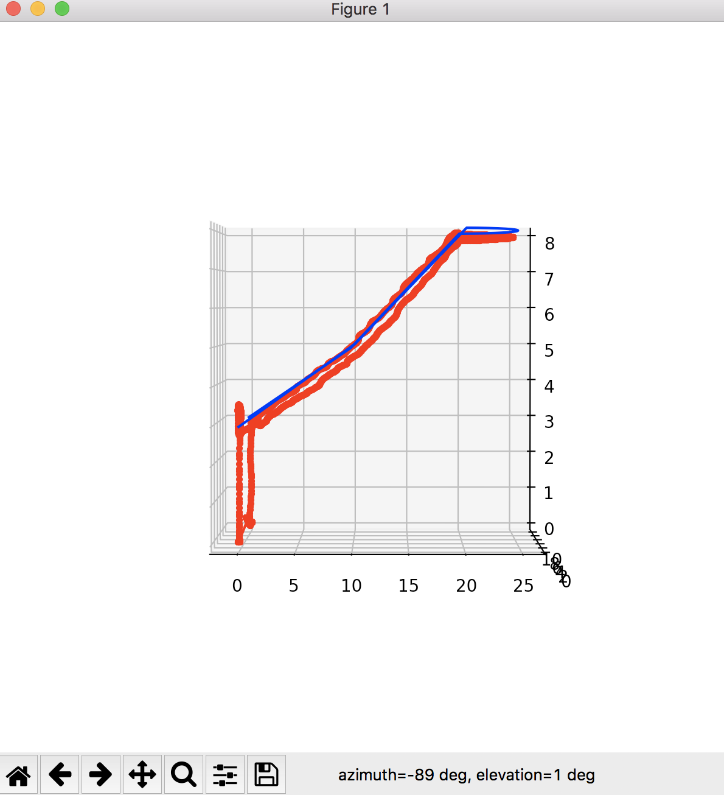
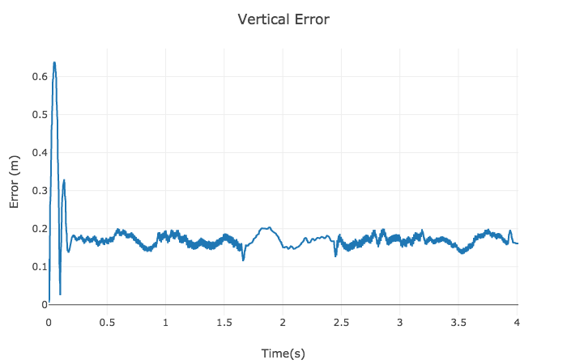
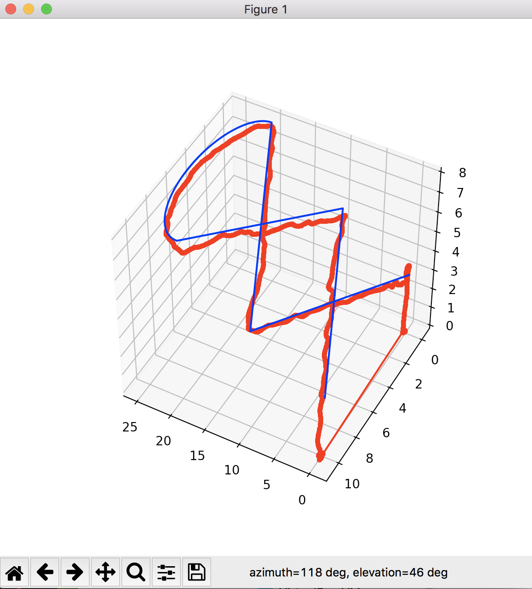
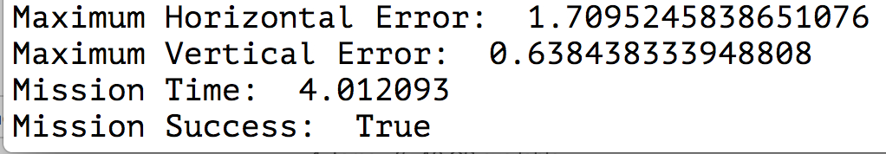

# Control of a 3D Quadrotor - Project (python)

### 1. controller.py method explanations

#### 1.1 . yaw_control(self, yaw_cmd, yaw)

Simple P controller : 
define an error in yaw, err=(yaw_cmd-yaw), and returns the proportion of that error.

#### 1.2 altitude_control(self, altitude_cmd, vertical_velocity_cmd, altitude, vertical_velocity, attitude, acceleration_ff=0.0)

Altitude is controlled by a PD controller with respect vehicle attitude and defined as : 

where 
<bar>
is altitude,vertical velocity and acceleration respectivly, and 
k_p and k_d is PD constans.
<bar>
where  
<bar> is the [3,3] element of the rotation matrix that represent drones attitude.

#### 1.3 body_rate_control(self, body_rate_cmd, body_rate)

Body rates determine the yaw,pitch,roll rotation speed in the body frame, and controlled by a P controller : 
 

#### 1.4 roll_pitch_controller(self, acceleration_cmd, attitude, thrust_cmd)

The most complex PD controller that uses acceleration in world frame and produce a desired roll,pitch rates in the body frame : 
  

 

where 

R is the rotation matrix. The given values can be converted into the angular velocities into the body frame by the next matrix multiplication. 

#### 1.5 lateral_position_control(self, local_position_cmd, local_velocity_cmd, local_position, local_velocity,acceleration_ff = np.array([0.0, 0.0]))

Lateral posiotn controller is a PD controller that use desired position and velocity to produce desired acceleration : 
  

### 2 .Results

### Horizontal trajectory :

### Horizontal error : 

### Vertical trajectory : 

### Vertical error : 

### 3D trajectory : 

### Console result : 

