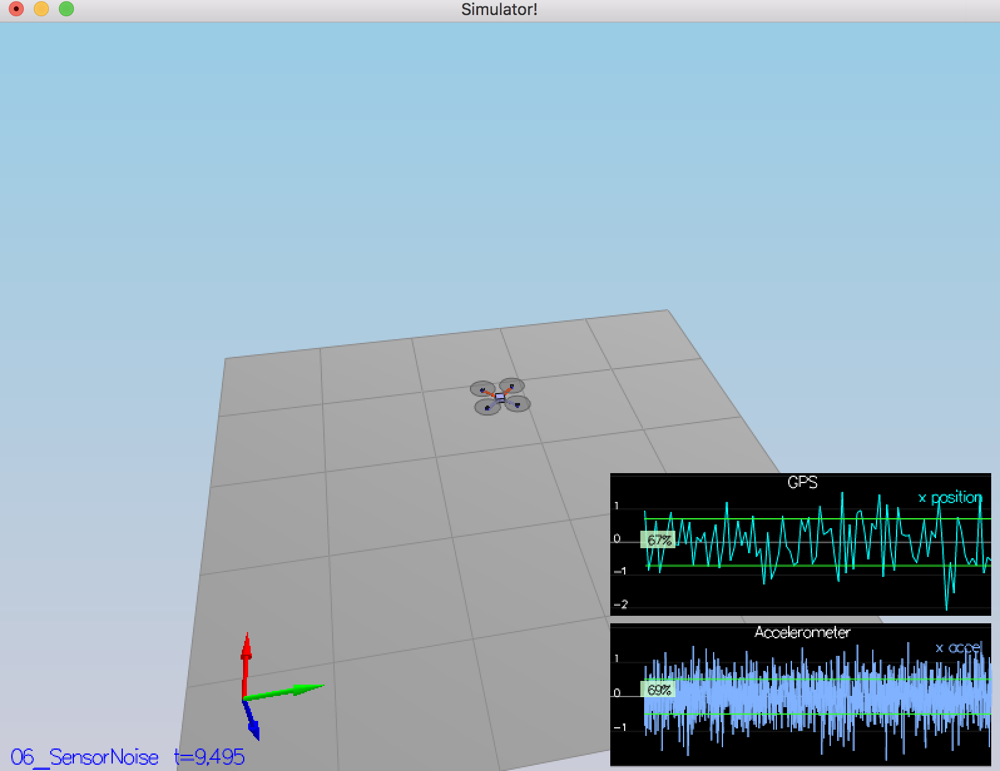
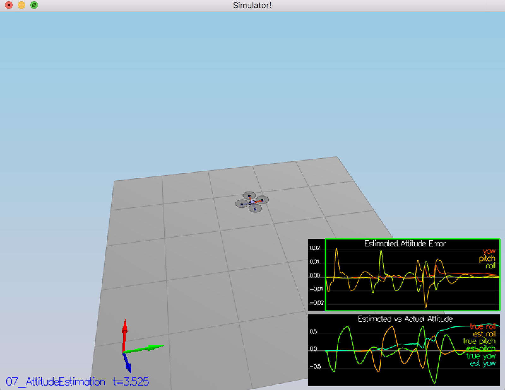
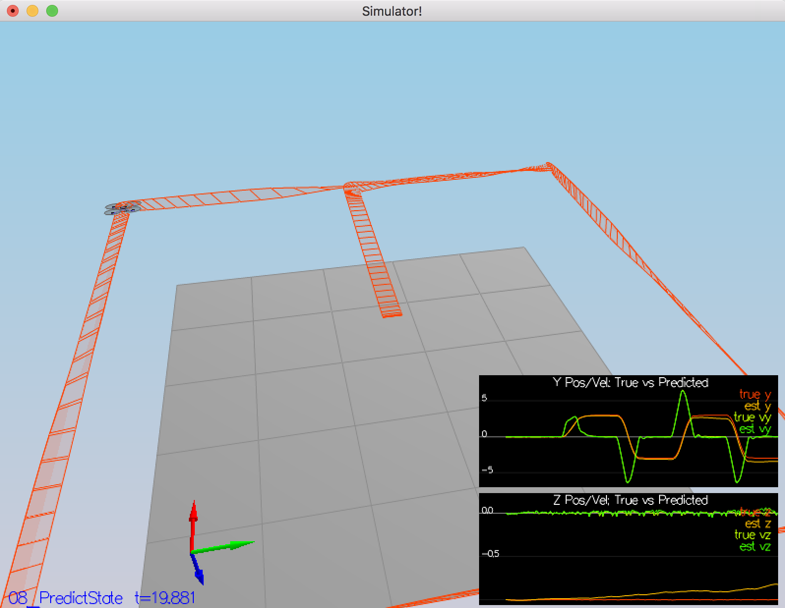
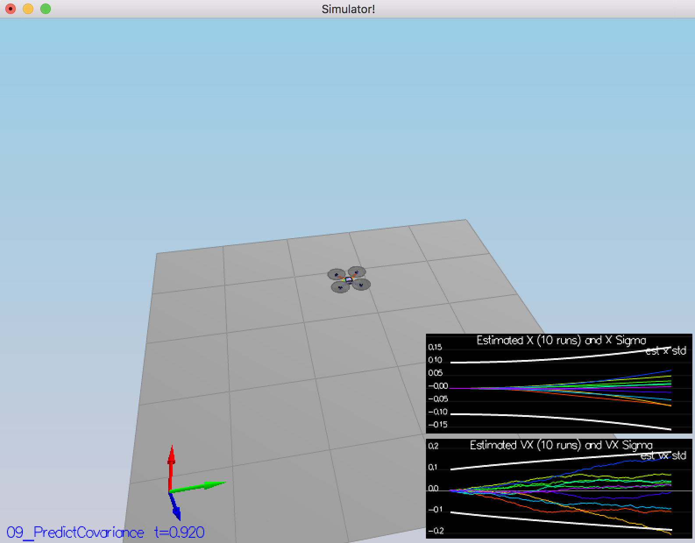
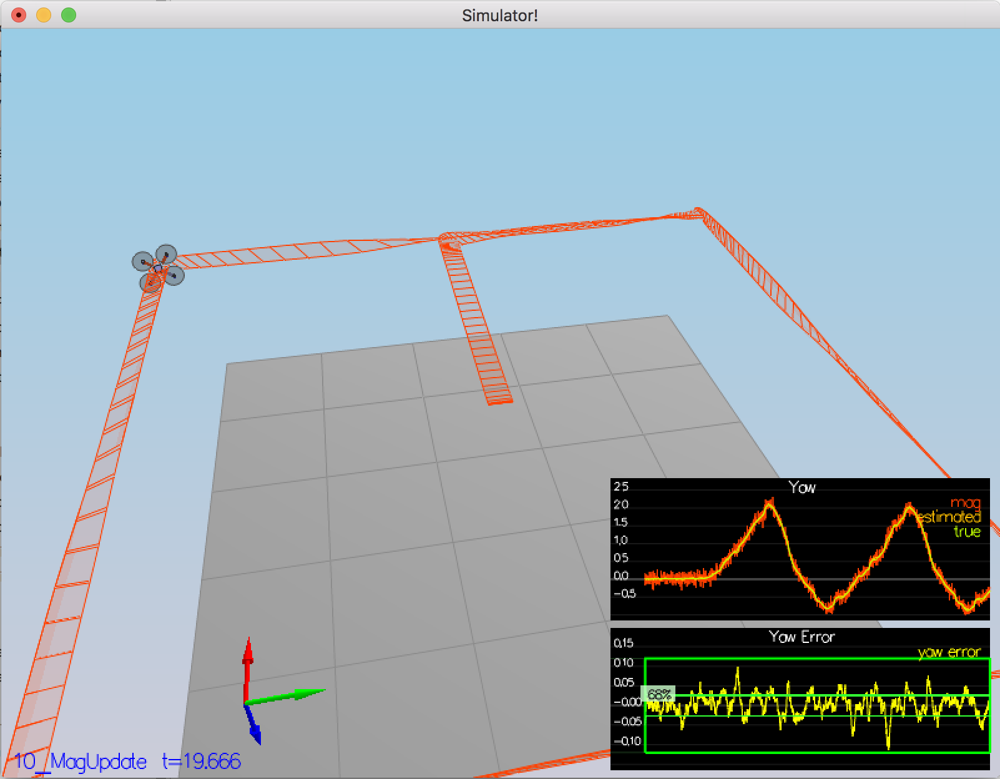
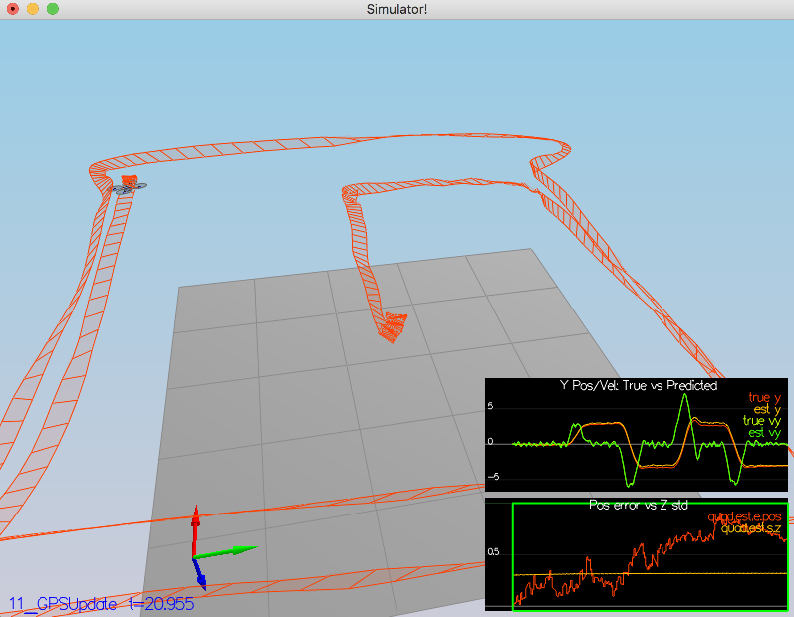

## The Estimation Project (C++)

#### 1. Determine the standard deviation.

Simple python program with the use of Numpy : 


```python
import numpy as np
GPS = np.loadtxt('Graph1.txt',delimiter=',',skiprows=1).T
ACCEL = np.loadtxt('Graph2.txt',delimiter=',',skiprows=1).T
print('GPS std : ',np.std(GPS[1,:]))
print('ACCEL std : ',np.std(ACCEL[1,:]))
```

    GPS std :  0.569949527456
    ACCEL std :  0.502197849147


Result :


#### 2. Implement a better rate gyro attitude integration scheme.

UpdateFromIMU() function was implemented as mentioned in the "Estimation for Quadrotors" documentation section 7.1.2 "Nonlinear Complementary Filter" :


```python
Quaternion<float> qt = Quaternion<float>::FromEuler123_RPY(rollEst, pitchEst, ekfState(6));
Quaternion<float> qt_bar = qt.IntegrateBodyRate(gyro, dtIMU);
    
float predictedPitch = qt_bar.Pitch();
float predictedRoll = qt_bar.Roll();
ekfState(6) = qt_bar.Yaw();
```

Result : 


 #### 3. prediction step for the estimator.

In this section three three function was implemented : PredictState(),GetRbgPrime() and Predict() : 

1.PredictState() - implements forwarding state by dt :


```python
V3F acc_world = attitude.Rotate_BtoI(accel);
predictedState(0) += predictedState(3)*dt;
predictedState(1) += predictedState(4)*dt;
predictedState(2) += predictedState(5)*dt;
   
predictedState(3) += acc_world.x*dt;
predictedState(4) += acc_world.y*dt;
predictedState(5) += (acc_world.z-CONST_GRAVITY)*dt;
```

2.GetRbgPrime() - implemented according to the Jacobian matrix descibes the derivitive of the rotation matrix that rotates from body frame to the global frame. That derevitive described in "Estimation for Quadrotors" documentation section 7.2 :


```python
float phi=roll,theta=pitch,psi=yaw;
RbgPrime(0,0) = -cos(theta)*sin(psi);
RbgPrime(0,1) = -sin(phi)*sin(theta)*sin(psi)-cos(phi)*cos(psi);
RbgPrime(0,2) = -cos(phi)*sin(theta)*sin(psi)+sin(phi)*cos(psi);
RbgPrime(1,0) = cos(theta)*cos(psi);
RbgPrime(1,1) = sin(phi)*sin(theta)*cos(psi)-cos(phi)*sin(psi);
RbgPrime(1,2) = cos(phi)*sin(theta)*cos(psi)+sin(phi)*sin(psi);
```

3.Predict() - function updates the covarians as a part of the EKF sequence : 


```python
gPrime(0,3)=dt;gPrime(1,4)=dt;gPrime(2,5)=dt;
float g_prime_3_6 = (RbgPrime(0,0)*accel.x+RbgPrime(0,1)*accel.y+RbgPrime(0,2)*accel.z)*dt;
float g_prime_4_6 = (RbgPrime(1,0)*accel.x+RbgPrime(1,1)*accel.y+RbgPrime(1,2)*accel.z)*dt;
gPrime(3,6)=g_prime_3_6;
gPrime(4,6)=g_prime_4_6;
    
ekfCov = gPrime * ekfCov * gPrime.transpose() + Q;
```

Result : 

Predict State :


Predict Covariance : 


#### 4. Implement the magnetometer update..

Here UpdateFromMag() function was implemented according to the documentation, section 7.3.2 and the EKF sequence :


```python
hPrime(0,QUAD_EKF_NUM_STATES-1)=1;
MatrixXf toInverse = hPrime * ekfCov * hPrime.transpose() + R_Mag;
MatrixXf K = ekfCov * hPrime.transpose() * toInverse.inverse();
    
zFromX(0)=ekfState(6);
zFromX(0) = zFromX(0) + (K*(z-zFromX))(6);
```

Result :


#### 5. Implement the GPS update.

Here UpdateFromGPS() function was implemented according to the documentation, section 7.3.1 and the EKF sequence :


```python
for(int i=0;i<QUAD_EKF_NUM_STATES-1;i++){
    zFromX(i)=ekfState(i);
    hPrime(i,i)=1;
}
MatrixXf toInverse = hPrime * ekfCov * hPrime.transpose()+R_GPS;
MatrixXf K = ekfCov * hPrime.transpose() * toInverse.inverse();
    
VectorXf res = K*(z-zFromX);
for(int i=0;i<QUAD_EKF_NUM_STATES-1;i++){
    ekfState(i)+=res(i);
}
```

Results :

