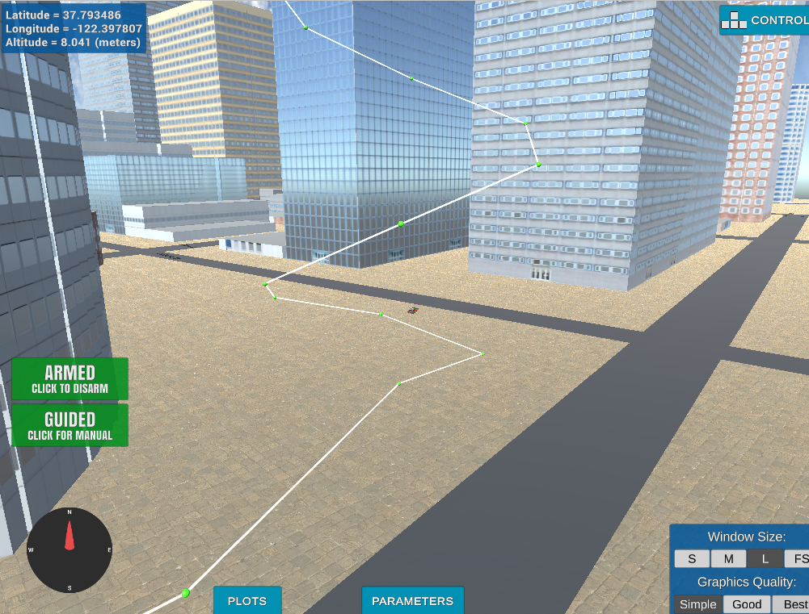

# 3D Motion Planning - Project


### 1. Compare planning_utils.py and motion_planning.py

#### 1.1 . Compare planning_utils.py

The planning_utils.py provides four function and one class :

1. create_grid(data, drone_altitude, safety_distance) - That function get a list of vectors which contains the data about the environment [x,y,z,dx,dy,dz] of each collition object - "data" parameter. "drone_altitude" - parameter define how high the drone is flying. It define which collision object will be include in the created grid or not depending on the hight of the object in "data". "safety_distance" - parameter define how much area will be added to each collision object in "data" to avoid over close path planing. The function return a 2d grid that represents free collision space according to given arguments.
    
2. class Action(Enum) - That class define four movment ways on the grid.

3. valid_actions(grid, current_node) - That function check return all posible moves on the grid relative to the given "current_node", it checks all the move defined in "Action" class.
4. def a_star(grid, h, start, goal) - That function search on the given grid for the optimal(shortest in a sense of distance - it can be redefined) path from node "start" to "goal" node and uses the parameter "h" as an additional cost for optimum.
5. def heuristic(position, goal_position) - That funtion define some heuristic parmeter(in that case distance) between node "position" and "goal_position" node.        

#### 1.2 Compare motion_planning.py

The motion_planning.py is very simmilar to previus version except of few additions :

1. New state added "PLANNING"
2. New transition method "plan_path()"
3. "send_waypoints()" method that transfer the estimated path to the simulator.

The new plan_path() method : 
1. Defines to parametes "TARGET_ALTITUDE" and "SAFETY_DISTANCE" used by "a_start" from planning_utils.py to find shortes path (as described above).
2. Load the environment map ('colliders.csv') as "data" to create grid with "create_grid" function from planning_utils.py.
3. "create_grid" also return "north_offset" and "east_offset" to relativly localize the drone on the grid.
4. Defines to points "grid_start" and "grid_goal" to simulate simple path estimation with "a_star"
5. Convert the found path to correct waypoints list and send it with "send_waypoints()" method. 

"plan_path()" method is called after ARMING and the execute the path mission.


### 2 .Implementing Your Path Planning Algorithm

#### 2.1 Extracting lat0 and lon0 
Using "open()","readline()" and "split" int python api :


```python
filename = 'colliders.csv'
line0 = open(filename).readlines()[0].replace(',','').split()
# line0 = ['lat0', '37.792480', 'lon0', '-122.397450']
lat0 = float(line0[1])
lon0 = float(line0[3])
print('lat0 {0}, lon0 {1}'.format(lat0,lon0))
# TODO: set home position to (lat0, lon0, 0)
self.set_home_position(lon0,lat0,0)
```

#### 2.2 Retriving position in geodetic coordinates
Using "self.global_position", "self.global_home" and corverting to local : 


```python
local_pos = global_to_local(self.global_position,self.global_home)
print('local_pos {0}'.format(local_pos))
```

output : local_pos [-0.18935215 -0.11324342  0.019     ]

#### 2.3 Define START position
Defining "start_grid" position by greating the grid with "cread_grid" and to get the east and north offsets.  
I decided to represent the obsticle map as 3D voxels map, i modified the function from the quiz to include "SAFETY_DISTANCE" and create the voxel map with safety padding. Also i use another parameter "voxel_size" to squeeze the voxel map for better performance.

Testing output : 


"start_grid" define by offsetting "local_pos" by "north_offset" and "east_offset" and dividing by "voxel_size".


```python
voxel_size = 10
grid, north_offset, east_offset  = create_voxmap(data, voxel_size,SAFETY_DISTANCE)
location_on_grid=[(local_pos[0] - north_offset),(local_pos[1] - east_offset)]
grid_start = (int(location_on_grid[0]), int(location_on_grid[1]))
start3d = tuple([int(x/voxel_size) for x in grid_start])+((TARGET_ALTITUDE/voxel_size),)
```

#### 2.3 Define GOAL position
Here i defined some "tmp_maps_latlon" to hold a lat,lon coordinate from any online map,
then rearranged it to "lonlatalt_goal" and passed to "global_to_local()" to get grid relative position then agian offsetting by "north_offset","east_offset" and dividing by "voxel_size" : 


```python
tmp_maps_latlon = [37.795659, -122.396507] #OVER BUILDING
lonlatalt_goal = [tmp_maps_latlon[1], tmp_maps_latlon[0] , 0]
goal_grid_offset=global_to_local(lonlatalt_goal,self.global_home)
print('goal_grid_offset : {0}'.format(goal_grid_offset))
grid_goal = (int(-north_offset+goal_grid_offset[0]),int(-east_offset+goal_grid_offset[1]))
print('Local Start and Goal: ', grid_start, grid_goal)
goal3d = tuple([int(x/voxel_size) for x in grid_goal])+((TARGET_ALTITUDE/voxel_size),)
```

outputs : 

goal_grid_offset : [353.24471281  80.7500275    0.        ]

Local Start and Goal:  (315, 444) (669, 525)

#### 2.4 Writing search algorithm
As i used 3D voxel map i implemented a 3D A* algorithm and defined the necessary "ACTION" class and "valid_actions" in such way that the drone will be able to move in (3*9)-1=26 ways in 3D.  Here 2d diagonal cost move where defined as np.sqrt(2) and diagonal move in 3D as np.sqrt(np.sqrt(2)+1)
Here is the result on testing for two arbitary points(start and goal) - green path: 


In "motion_planning.py" i excuted like : 


```python
path, _ = a_star(grid, heuristic, start3d, goal3d)
```

#### 2.5 Collinearity check
The collinearity check walks through all consecutive three p1,p2,p3 points in path and create new list appending p2 if p1,p2,p3 the determinate of 3x3 matrix that they represent is not less then some epsilon.
The function called "prune_path(path)"

prunning result : 


```python
path = prune_path(path)

waypoints = []
for i,p in enumerate(path[1:len(path)-1]):
    p1,p2,p3 = (path[i-1],path[i],path[i+1])
    yaw_p3 = np.arctan2((p2[1]-p1[1]), (p2[0]-p1[0]))
    waypoints.append([int(p[0]*voxel_size + north_offset),int(p[1]*voxel_size + east_offset), int(p[2]*voxel_size), yaw_p3])
```

### 3. Running the code
Results :


### 4. Extra
Spiral path were added to the end of the search path : 


```python
def spiral_path(start,radius=1,height=1,smoothness=16):
    spiral = []
    for t in np.linspace(0,np.pi*2,20):
        x=radius*np.cos(smoothness*t)
        y=radius*np.sin(smoothness*t)
        z=t*height
        x+=start[0]
        y+=start[1]
        z+=start[2]
        spiral.append([x,y,z])
    return spiral

path.extend(spiral_path(path[len(path)-1]))
```

results :



